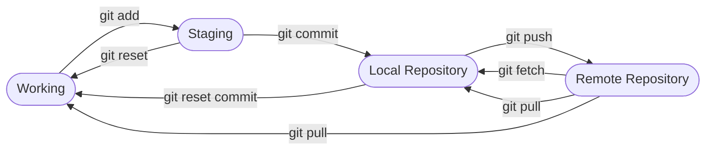

## Git Commands



## Using git
- Before you can do anything you need to configure git.
  - ```git config --global user.name "John Doe"```
  - ```git config --global user.email johndoe@gmail.com```
- Creating/Getting projects
  - ```git init``` - starts new project
  - ```git clone``` - clones an existing project.
- Useful git commands
  - ```git log``` - shows commit history.
  - ```git diff``` - shows changes by comparing current working directory and the last commit
  - ```git blame``` - shows revision history for a file along with author and date
  - ```git status``` - shows current status of repository
  - ```git add``` - add files to be committed. Use ```.``` to add all files.
  - ```git commit``` - commit changes 
    - ```-m``` option to do a message.
    - ```-am``` option to do a message and add files that have been committed before.
  - ```git reset``` - unstage all changes, add ```<FILENAME>``` if you only want to unstage some files.
    - ```--soft``` - reset to previous commit but keeps changes in the working directory.
    - ```--mixed``` - resets to previous commit and removes changes in staging area but keeps them in the working directory. This is the default.
    - ```--hard``` - resets to previous commit and removes changes from staging area and working directory.
  - ```git restore``` - place a file back into the working directory.
  - ```git branch <name>``` - creates a new branch with given name.
    - ```-m <old-name> <new-name>``` - rename a branch.
  - ```git checkout <branch>``` - checkouts a branch.

## Git and SSH
- ```sshd``` - initiate server.
- ```ssh-keygen``` - program used to create keys.
  - ```-b``` - how many bits.
  - ```-t``` - what type of encryption (rsa/ecdsa/etc)
- ```ssh-copy-id``` - used to copy and install ssh keys to help automate.
- ```ssh-agent``` - helps track identity keys and passphrases.
- ```ssh-add``` - used to add a key to the ssh authentication agent.
- ```scp``` - used to copy files over ssh
- ```sftp``` - used to copy files over ssh. Preferred method.
### Add SSH key to Gitlab
- Create ssh key
- Copy ssh key from ```.ssh``` folder. The public key.
- In Gitlab
  - Go to profile settings
  - Click ```Preferences```
  - Click ```SSH Keys```
  - In key window paste SSH public key info.
  - Edit expiration as needed
  - Click add key

## Git Merging
- Create isolation using branches
- Separate by features
- Types of Merges:
  - ```Explicit Merge``` - default merge type. Create new merge commit. Explicitly shows where merge is executed in commit history. Provide good traceability.
  - ```Implicit Merge``` - via rebase or fast-forward. Does not create a merge commit. Just takes a number of commits from the specified branch and puts them at the top of the target branch.
  - ```Squash on Merge``` - Another type of implicit. Takes commits from target branch and squashes them into one commit which is then applied to the HEAD of the merge base branch. Interactive rebase.
- Types of Merge Strategy:
  - ```Recursive``` - Default. Can detect and handle merges involving renames but cannot make use of detected copies.
  - ```Resolve``` - Resolve 2 heads using a 3-way merge algorithm. Generally safe and fast.
- Steps to Merge:
  - ```Prepare to merge``` - Create, edit, delete files. Then stage and commit.
  - ```Confirm the Receiving Branch``` - do a ```git status``` to ensure that HEAD is pointing to the correct merge-receiving branch.
  - ```Fetch latest remote commits``` - Make sure all branches are up to date.
  - ```Merging``` - Now merge.
  - ```Fast Forward Merge``` - This can only occur if there is a linear path from the current tip to the target branch. Git integrates the history to the current branch.
- Merge Approvals
  - If approval is required then you will need to assign a provider.
  - Create required rules about the number and type of approver before work can merge.
- Merge Conflict
  - When a file was modified in one branch at the same line or set of lines in two different commits.
     - ```git merge --abort``` - undo a merge conflict and return to the state before.
     - ```git rebase --abort``` - Git will return you to your branch's state as it was before ```git rebase``` was called.
- Solve conflict
  - Accept the local version
  - Accept the remote version
  - Review changes individually.


**Procedures/Commands**

##Create Remote Branch:

- Push local _main_ branch to remote using ``git push -u origin main``
- Verify using ``git remote -r``

**Create Local Branch:**

- Create a branch using ``git branch (new-branch-name)`` then ``git switch -c(new-branch-name)
- Can checkout to the _master_ or _main_ (verify what your top branch is) using ``git checkout (whatever your top branch is)``
- To rename a branch use ``git branch -m (old-name) (new-name)``

**Connect Local Repository to Remote Repository**
**Procedures/Commands**

1. **Get remote repository ssh clone address:**
     - Login to GitLab
     - Click the ``Clone`` dropdown and select the ``Copy URL`` button under the ``Clone with SSH`` field
2. **Add Git remote repository to local Git Repository:**
     - Open git bash
     - cd to local folder
     - Input the ``git remote add origin < SSH clone address from previous step >``
     - Verify using ``git remote -v``

**Create Local Clone of Remote Repository**
**Procedures/Commands**

1. Open Git Bash
2. ``cd`` to desired directory
3. Run the ``git clone < SSH clone address copied from GitLab > ``
4. Verify using ``git remote -v``

**Git Merge Requests**
**Procedures/Commands**

1. **Confirm receiving branch:** Execute ``git status`` to ensure HEAD is pointing to correct merge-receiving branch. If needed execute ``git checkout < branch name >`` to switch to the receiving branch
2. **Fetch latest commits:** Execute ``git fetch`` to pull latest remote commits. Ensure receiving branch has latest updates by executing ``git pull``
3. **Merging:** Merge can be initiated by ``git merge < branch that will be merged >`` where the inputted branch will merge into receiving branch

**Resolving Conflicts**

- **git status:** identifies conflicted files
- **git log --merge:** produces a log with a list of commits that conflict between branches
- **git diff:** finds differences between states of a repo/files
- **git merge --abort:** will exit from the merge process and return the branch to previous state.
- **git rebase --abort:** completely undo the rebase. You can also run ``git rebase --skip`` to skip the commit (none of the changes introduced by bad commit will be included)

## Version Control
**Procedues/Commands:**

**Tracking in Git:**

- **git diff:** compares changes from current working directory and last commit, or between two commits
- **git log:** shows commit history (includes _author_, _date_, and _commit messages_)
     - **-n#:** shows specific # of lines
- **git blame:** shows revision history of a file with author and date of each change
-  **git status:** shows current status of repository including which files have modified, stage changes, and untracked files

**Committing Changes:**

- **git add:** stage the changes to include to next commit
- **git commit:** create a new commit
     - **-m:** adds a comment

**Undo Staged Changes:**

- **git status:** see which changes are staged
- **git reset:** unstage all changes followed by name of file(s) to unstage
- **git restore:** needed to place file back in working tree/directory

## SSH Key Pair Generation
**Process For Generating Keys**
1. The following commands are all executed from the command line on your workstation:
**ssh-keygen -t rsa -b 2048**
2. Which will display the following:
**Generating public/private rsa key pair. 
Enter file in which to save the key (/root/.ssh/id_rsa):** 
3. Hit Enter to accept the default location. Next the system will show:
**Enter passphrase (empty for no passphrase):**
4. So just hit Enter here. Finally, it will ask for you to re-enter the passphrase:
**Enter same passphrase again:**
5. So hit Enter a final time.

You now should have an RSA type public and private key pair in your .ssh directory:

**cat ~/.ssh/id_rsa**

**cat ~/.ssh/id_rsa.pub**

**. .. id_rsa id_rsa.pub**